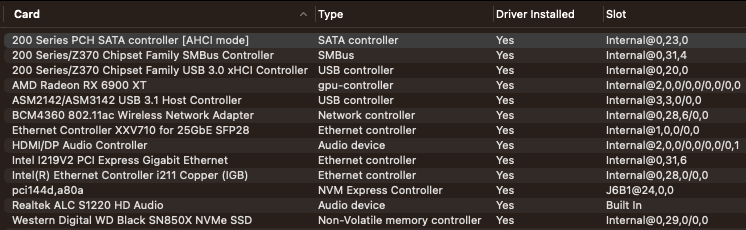
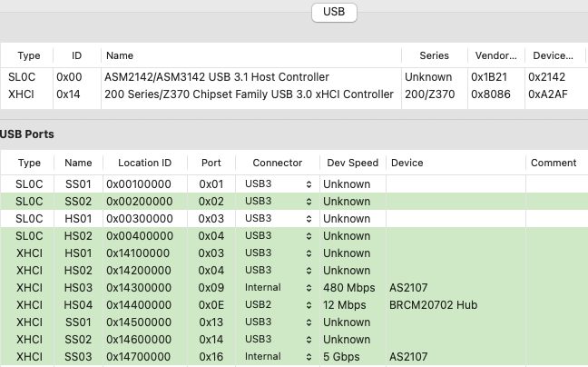
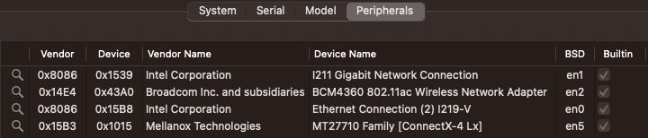
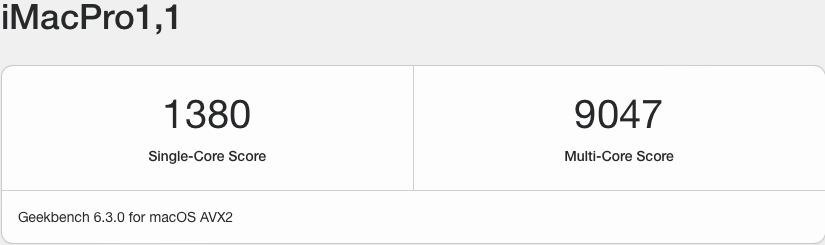
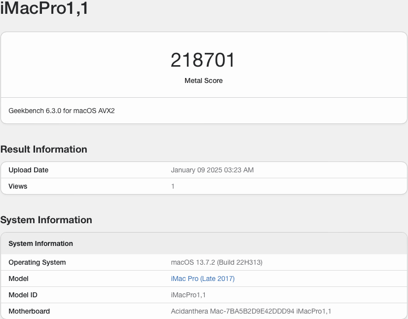
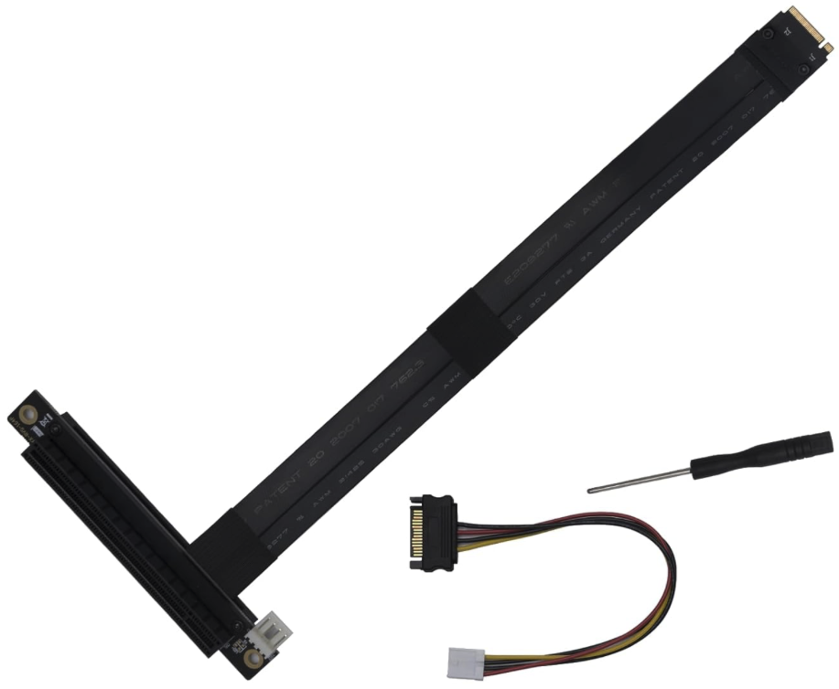
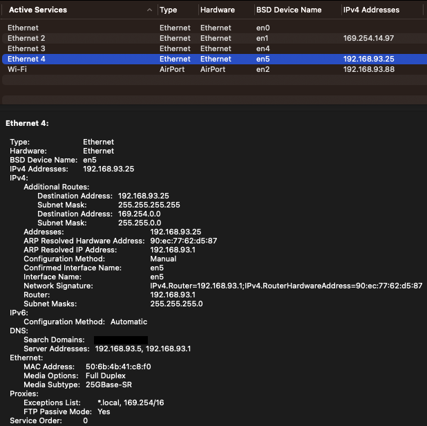

# ASRock X299E-ITX/AC with Opencore 1.0.5

  
 

 

  
 

 

  
 

 

  
 

 

  
 

  

  
 

## Specs
| **Component** | **Model** |
| ------------- | --------- |
| CPU | i9-10900X 10 cores and 20 threads @3.7GHz |
| RAM | 4x16GB 2666MHz DDR4 SO-DIMM Crucial CT16G4SFRA266 |
| Audio Chipset | Realtek ALC S1220. Works with Layout-id 7 |
| dGPU | Sapphire AMD Radeon RX6900XT. Works OOB |
| WiFi & Bluetooth | Fenvi BCM94360NG. Works OOB |
| OS Disk | 2TB WD SN850X |
| macOS | Ventura 13.7.8 (22H722)/OpenCore 1.0.5

## BIOS
- Press F2 or Del to enter the BIOS. Use latest available bios for the system 2.20B
- Multi Core Envancement Disabled
- SATA Mode AHCI
- XHCI Hand-Off Enabled
- For more detailed settings download folder BIOS-Screenshots

## Installation instructions
- Adjust your config according to your GPU. I am using a "natively" supported GPU with no WEG kext.
- Generate your own SMBIOS obviously. The one in the config now is just a sample for installation purposes only. Do not use it in your system.
- Follow instruction to emulate NVRAM by running a command Launchd.command from OpenCore release Utilities folder and LogoutHook subfolder https://dortania.github.io/OpenCore-Post-Install/misc/nvram.html

## Post Installation
- Emulate NVRAM following Dortania's instruction

## Adding 25GB NIC
I used one of the available PCIe Gen3 x4 ports on the back of the motherboard and plugged an adapter like this https://www.amazon.com/dp/B0CLD88KXS

  

  
 

The two network cards that work OOB that are on the affordable side are Intel XXV710-DA1 and Mellanox MCX4111A-ACAT

I suggest using Mellanox MCX4111A-ACAT single or double module variants as Intel card was giving me issues accessing SMB shares on the network.
  

  
 

 ß